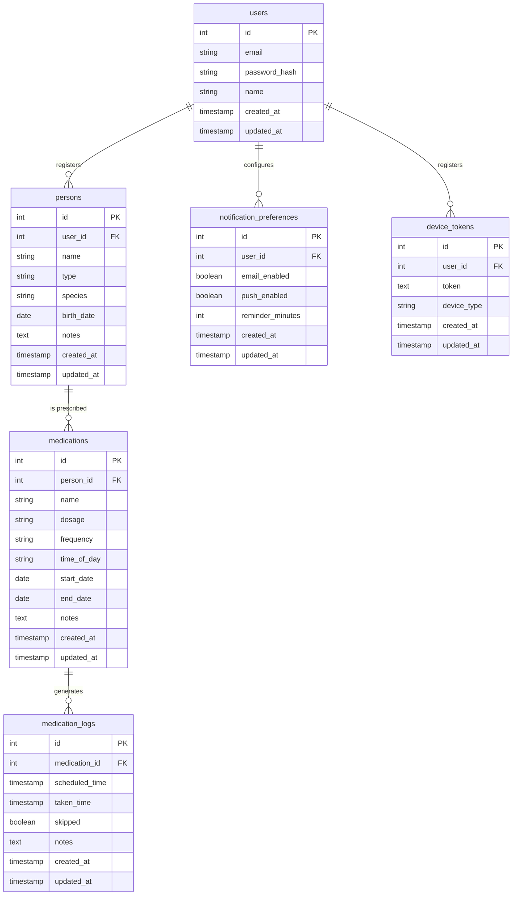

# Table of Contents
- [Database Schema (ER Diagram)](#database-schema-er-diagram)

# Database Schema (ER Diagram)

```mermaid
erDiagram
    users ||--o{ persons : "registers"
    users ||--o{ notification_preferences : "configures"
    users ||--o{ device_tokens : "registers"
    persons ||--o{ medications : "is prescribed"
    medications ||--o{ medication_logs : "generates"

    users {
        int id PK
        string email
        string password_hash
        string name
        timestamp created_at
        timestamp updated_at
    }
    
    persons {
        int id PK
        int user_id FK
        string name
        string type
        string species
        date birth_date
        text notes
        timestamp created_at
        timestamp updated_at
    }
    
    medications {
        int id PK
        int person_id FK
        string name
        string dosage
        string frequency
        string time_of_day
        date start_date
        date end_date
        text notes
        timestamp created_at
        timestamp updated_at
    }
    
    medication_logs {
        int id PK
        int medication_id FK
        timestamp scheduled_time
        timestamp taken_time
        boolean skipped
        text notes
        timestamp created_at
        timestamp updated_at
    }
    
    notification_preferences {
        int id PK
        int user_id FK
        boolean email_enabled
        boolean push_enabled
        int reminder_minutes
        timestamp created_at
        timestamp updated_at
    }
    
    device_tokens {
        int id PK
        int user_id FK
        text token
        string device_type
        timestamp created_at
        timestamp updated_at
    }
```