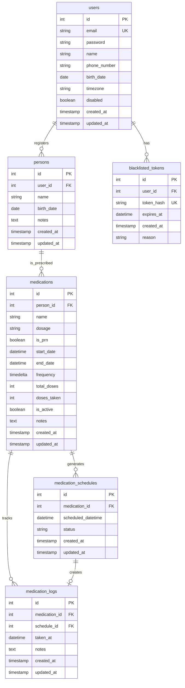

# Architecture Documentation

## Table of Contents
- [Database Schema (ER Diagram)](#database-schema-er-diagram)
- [Model Relationships](#model-relationships)

## Database Schema (ER Diagram)

## Model Relationships

### Core Entities

**Users**
- Primary entity representing system users
- Has one-to-many relationship with persons (can manage multiple people)
- Has one-to-many relationship with blacklisted tokens for security

**Persons** 
- Represents individuals whose medications are being tracked
- Each person belongs to a user (caregiver relationship)
- Has one-to-many relationship with medications

**Medications**
- Represents prescribed medications for a person
- Can be scheduled (regular intervals) or PRN (as needed)
- Tracks dosage information, frequency, and active status
- Has one-to-many relationships with both schedules and logs

### Scheduling & Tracking

**Medication Schedules**
- Represents individual scheduled doses
- Links to a specific medication with a scheduled datetime
- Tracks status: `scheduled`, `notified`, `taken`, `late_taken`, `skipped`, `missed`
- Has optional one-to-one relationship with medication logs when completed

**Medication Logs**
- Records when medications are actually taken
- Can be linked to a schedule (for scheduled doses) or standalone (for PRN doses)
- Tracks actual taken time and optional notes

### Security

**Blacklisted Tokens**
- Manages JWT token invalidation for security
- Stores hashed tokens to prevent reuse after logout
