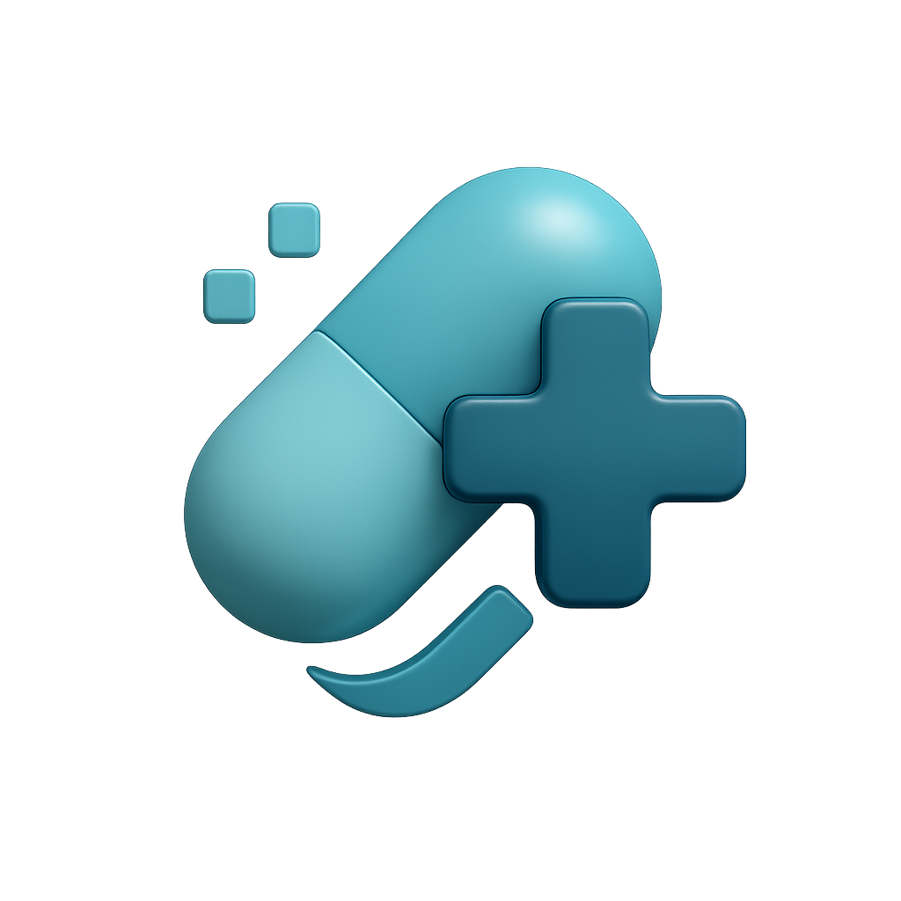

<p align="center">

</p>

Remedi is a comprehensive medication management and tracking system built with FastAPI. It enables users to manage medications for themselves and others, offering automated scheduling, adherence tracking, and a detailed medication history.

## Features

* **Multi-User Support**: Caregivers can manage medications for multiple people
* **Medication Management**: Add, update, and track both scheduled and PRN (as-needed) medications
* **Automated Scheduling**: Intelligent scheduling system that generates doses based on frequency
* **Adherence Tracking**: Monitor medication compliance with detailed logging
* **Timezone Support**: Accurate scheduling across different timezones

## Architecture

The application uses a relational database with the following core entities:
* **Users**: System users (caregivers)
* **Persons**: Individuals receiving medication care
* **Medications**: Prescribed medications with dosage and frequency
* **Schedules**: Individual scheduled doses with status tracking
* **Logs**: Records of actual medication intake
* **Blacklisted Tokens**: Security token management

See [ARCHITECTURE](ARCHITECTURE.md) for more details.

## API Documentation

### Interactive Documentation
Once the application is running, you can access:
* **Swagger UI**: `/docs` - Interactive API documentation
* **ReDoc**: `/redoc` - Alternative API documentation

### API Collection
A [Hoppscotch](https://hoppscotch.io/) collection is available in the repository [`remedi_collection.json`](remedi_collection.json), containing example requests.

## Getting Started

### Prerequisites
* Docker and Docker Compose
* uv (Python package manager)

### Quick Start with Docker
```bash
# Clone the repository
git clone <repository-url>
cd remedi

# Run with Docker Compose
docker compose up
```

The application will be available at `http://localhost:8000`

### Development Setup
```bash
# Clone the repository
git clone <repository-url>
cd remedi

# Setup development environment (installs dependencies and pre-commit hooks)
make setup

docker compose up
```
To remove pre-commit hooks (if needed), run:
```bash
rm .git/hooks/pre-commit
```

The development setup (`compose.override.yml`) includes:
* **Hot Reload**: Automatic code reloading with uvicorn
* **Debugger**: DebugPy integration for debugging
* **Volume Mounts**: Live code changes without rebuilding

### Available Make Commands
The project includes a `Makefile` for easier development:

```bash
make setup    # Install dependencies and pre-commit hooks
make style    # Format code and fix linting issues
make test     # Run tests with coverage
```

### Settings
Various settings influence application behavior. Refer to `app/settings.py` for the full list. Key settings include:

* `DB_USER`, `DB_PASSWORD`, `DB_HOST`, `DB_PORT` and `DB_NAME`: Database configuration
* `REDIS_HOST`, `REDIS_PORT` and `REDIS_DB`: Redis (cache) configuration
* `JWT_SECRET_KEY`: Secret key for JWT token generation
* `ALLOW_REGISTRATION`: Enable/disable new user registration

## Deployment

### Docker Images
Pre-built Docker images are available:
* **Latest Stable**: `ruitcatarino/remedi:latest`
* **Development**: `ruitcatarino/remedi:unstable`
* **Tagged Releases**: `ruitcatarino/remedi:<tag>`

### CI/CD Pipeline
The project includes automated CI/CD that:
* Runs comprehensive tests on every commit
* Publishes (manually) development images to `unstable` tag
* Creates stable releases on git tags
* Maintains automatic test coverage and code quality checks

## Contributing

This project is in active development. Contributions, bug reports, and feature requests are welcome!

### Development Guidelines
* Follow existing code style and patterns
* Add tests for new functionality (minimum 80% coverage required, to be increased)
* Update documentation for API changes
* Use type hints throughout the codebase
* Run `make test` before submitting changes

### Code Quality
The project maintains high code quality standards with:
* **Ruff**: Code formatting and linting
* **MyPy**: Static type checking
* **Pre-commit hooks**: Automatic code quality checks
* **Test Coverage**: Minimum 80% coverage requirement, to be improved

## License

This project is licensed under the AGPL-3.0 License. See the [LICENSE](LICENSE) file for details.

## Links

* **API Documentation**: Available at `/docs` when running
* **Hoppscotch Collection**: [`remedi_collection.json`](remedi_collection.json) in repository
* **Architecture Documentation**: [`ARCHITECTURE.md`](ARCHITECTURE.md) in repository
* **Docker Hub**: [ruitcatarino/remedi](https://hub.docker.com/r/ruitcatarino/remedi/tags)

---

**Note**: This application is under active development. Features and API endpoints may change. Always refer to the auto-generated OpenAPI documentation (`/docs`) for the most current API specifications.
